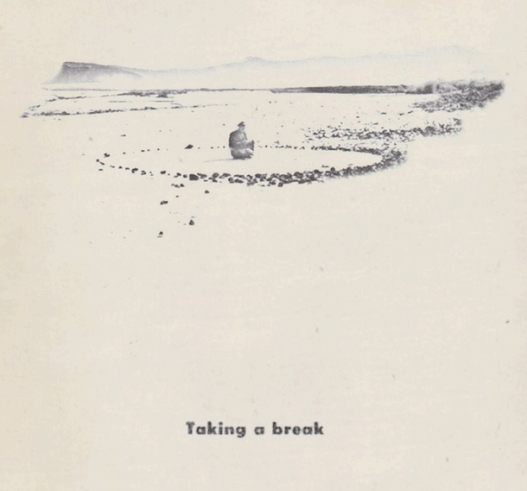
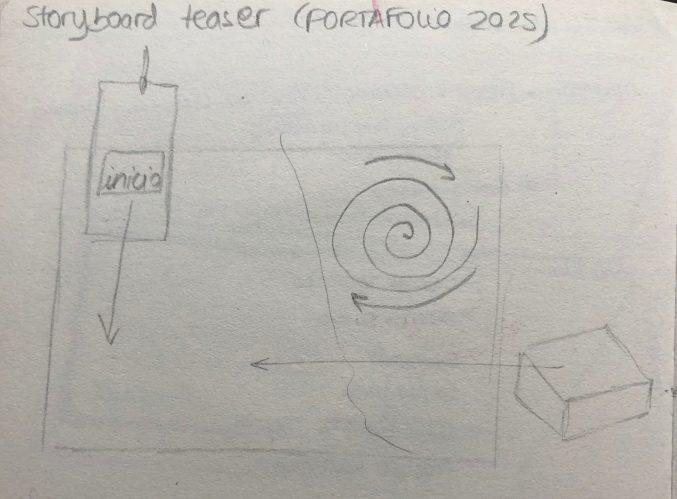
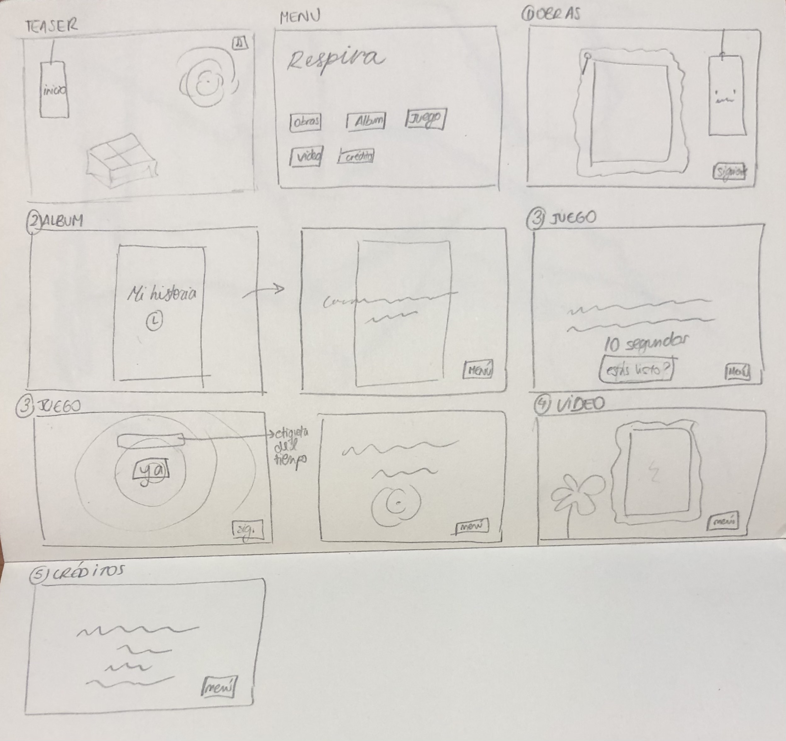

##Respira 

Proyecto de Creación Multimedia Interactiva de la  Facultad de Bellas Artes de la Univesidad de Granada

# 1 Datos 

**Titulo** : Respira

**Web:**   https://github.com/lunamorello
           https://lunamorello.itch.io/respira

**Autor:**  Luna Morello

**Resumen** : Este proyecto tiene como temática la infancia vista a través del filtro de la nostalgia. 

**Estilo/género:**   portfolio 

**Logotipo** : 

**Resolución:** 1152x650px 

**Probado en:** Google Chrome 

**Tamaño proyecto:** 79,56 KB 

**Licencia** Este proyecto tiene una Licencia CC Reconocimiento Compartir igual (CC BY-SA)

**Fecha** : 28/05/2025

**Medios** 

- Github:https://github.com/lunamorello

# 2. Memoria del proyecto 

### 2.1 Storyboard: 

### 2.2. Esquema de navegación 

# 3. Metodología

### Etapa 1: Ideación de proyecto

**Investigación de campo** 

- Para el juego me inspiró mucho este llamado 'Nothing' de Zitaoye (https://yezi.itch.io/nothing)

**Motivación de la propuesta** 

Este  proyecto tiene como temática principal la infancia desde un punto de vista nostálgico. Ofrece una experiencia interactiva de introspección y presenta una serie de ilustraciones en blanco y negro que conforman la colección que protagoniza este portafolio. Quería crear un ambiente digital interactivo que sirviera como una ventana hacia el pasado de cada uno, que invite a reflexionar y a rememorar todo desde un sentimiento de paz y calma que intenté reflejar con la estética del proyecto y la música. 

**Publico / audiencia**

- Puede ser utilizado por cualquier persona de cualquier edad, pero está más orientado a los adultos ya que son aquellos que tienen la infancia más lejana por lo que les será más emotivo recordar. 

### Etapa 2: Desarrollo / actividades realizadas

- Primero hay un teaser que lleva al menu del proyecto. Ahí tenemos el boton de la música, y los botones que nos llevan a las distintas partes. 
- Para las tipografías utilicé la misma para todo el proyecto para mantener la cohesión, y los mismos colores.  
- El juego es una experiencia interactiva que tiene como objetivo echar la mirada hacia el pasado y completar diez segundos meditativos. Antes de este, hay un album de recuerdos sobre mi vida que muestra como me afectó a mi personalmente la emoción de la nostalgia con las mudanzas que experimenté como contexto y factor decisivo. 
- El video es una animación hecha con la técnica del Stop Motion, y consiste en el elemento de la espiral moviéndose por las ilustraciones del portafolio. 
- La única parte que tiene instrucciones es el juego y son bastante sencillas, ya que todas las partes del portafolio pretenden crear un ambiente tranquilo y meditativo.  
- La música es la misma en todo el proyecto y es relajante. Hay un botón en el menu para que pare y se reanude.
- El estilo quería que sea lo más minimalista posible, muy orgánico y relajante. Con tonos muy poco saturados de marrón y gris. Para que transmita la mayor paz posible. Elegí elementos que evocan la nostalgia, como las cartas, los papeles y las cosas analógicas en general. 
  

### Etapa 3: Problemas identificados

Considero que el juego podría estar mejor realizado, o ser más complejo, pero en general creo que funciona todo bastante bien y permite meterse en la experiencia sin ningún problema. 

# 4. Conclusiones 

Me pareció bastante complicado al principio ya que es algo totalmente nuevo para mi, pero al final verlo terminado y sentirme satisfecha con mi trabajo me dió motivaciuón para en un futuro volver a utilizar este programa para mis proyectos personales. 

# 5 Referencias 
- La importancia de recordar: la nostalgia como refugio y motor
(https://www.abc.es/bienestar/psicologia-sexo/psicologia/importancia-recordar-nostalgia-refugio-motor-20250424162551-nt.html?ref=https%3A%2F%2Fwww.abc.es%2Fbienestar%2Fpsicologia-sexo%2Fpsicologia%2Fimportancia-recordar-nostalgia-refugio-motor-20250424162551-nt.html) 

**Recursos y materiales audiovisuales:**

* Musica: Es una melodia envolvente, instrumental de carácter relajante.  
* Imágenes:  Las imágenes son ilustraciones mías, fotografías de mi infancia y fotografías de Pinterest. 
* Tipografía: La tipografía utilizada se llama Kenya. 

**Herramientas utilizadas**

- Godot Engine 4.4.1
- 

https://creativecommons.org/licenses/?lang=es

Mayo 2025
